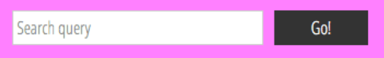

# Learn styling web pages

> #### [reading note of [Mozilla Structing components](https://developer.mozilla.org/en-US/docs/Learn_web_development/Core/Structuring_content/Structuring_documents)]


[Facts] Most webpages tend to share similar standard components. It's important to respect semantics and use the right element for the right job, because the html/css is too flexible.

"It's good to understand the overall meaning of all the HTML sectioning elements in detail."

> See link here [HTML element reference (not too many)](https://developer.mozilla.org/en-US/docs/Web/HTML/Element)

## HTML structure has

These below are so-called 'semantic elements'. `<div>, <span>..` are non-semantic wrappers usually used with a suitable `class` attribute, so they can be easily targeted.

### 1. header: a big heading, logo. remains consistent for a website usually.

`<header>`

### 2. navigation bar: links, buttons, tabs. remains consistent for a website.

`<nav>`

Navigation links are arranged as a list like this:

```html
<nav>
  <ul>
    <li><a href="#">Home</a></li>
    <li><a href="#">Our Team</a></li>
    <li><a href="#">Projects</a></li>
    ...
  </ul>
</nav>
```

A search bar and a button as a `<form>`.



```html
<form>
  <input type="search" name="q" placeholder="Search query" />
  <input type="submit" value="Go!" />
</form>
```

### 3. main content: video, story, map, news.

> 'main' can only used once per page. It should be `<body>  <main>`

```html
<main>
  <article>
    <h2>
      <p></p>
      <section>
        <h3>
          <p>a paragraph</p>
          <p></p>

          <section>
            <h3>
              <p></p>
            </h3>
          </section>
        </h3>
      </section>
    </h2>
  </article>
</main>
```

### 4. sidebar: info, links, quotes, ads

```html
<aside>
  <h2>
    Related
    <ul>
      <li></li>
      <li></li>
      <li></li>
    </ul>
  </h2>
</aside>
```

### 5. footer: fine print, copyright notices, contact info.

```html
<footer>
  <p>@copyright 2025 by me. All rights reserved.</p>
</footer>
```

<hr>

## All HTML elements (my understandings)

1. main root `html`
2. document **metadata**. (Metadata contains info about the page. This includes styles, scripts and data to indicate how to render the page. They can be inserted in the page or linked to another file)
   1. `base`, only once a page, specifies the base URL for all relative URLs in the page.
   2. `head`, wraps the machine-related info (title, scripts, css).
   3. `link`, tell a relationship to another file. used for css file, icons.
   4. `style`, contains css style info applying to this webpage.
   5. `title`, text show in the browser's tab
   6. `meta`, 'other meta data' (thoses can't be represented by base, head, etc.)
3. Sectioning root `body`, only once a page, represents the content of a webpage.
4. Content sectioning. (allows you to organize the content into logical pieces)
   1. `address`
   2. `article`
   3. `aside`
   4. `footer`
   5. `header`
   6. `h1h2h3h4h5h6`
   7. `hgroup`
   8. `main`
   9. `nav`
   10. `section`
   11. `search`
5. Text content. (organize block or section in `body`)
   1. `blockquote`
   2. `dd`, description and definition
   3. `div`, generic container for flow content.
   4. `dl`
   5. `dt`
   6. `figcaption`
   7. `figure`
   8. `hr`
   9. `li`
   10. `menu`
   11. `ol`
   12. `p`
   13. `pre`
   14. `ul`
6. Inline text semantics. (for text styles)
   1. `a`. use with `href`
   2. `abbr`. abbreviation or acronym.
   3. `b`, `strong`. creat boldface text.
   4. `bdi`. bidirection text, for multilingual.
   5. `bdo`. overrides current directionality of text
   6. `br` a line break in text
   7. `code`
   8. `data`
   9. `dfn`, a difinition phrase or sentence.
   10. `em`. test has stress emphasis
   11. `i`, using italicized type
   12. `kbd`, input from a keyboard, voice input, etc
   13. `mark`, marked or highlighted text
   14. `q`, a short inline quotation
   15. `rp, rt, ruby`. for ruby annotation
   16. `s`. text with a strikethrough
   17. `samp`, sample output from a computer program.
   18. `small`, small print, like copyright and legal text.
   19. `span`, like '<div>', but 'div' is a block-level element, whereas 'span' is an inline-level element.
   20. `strong`, indicates the text has strong importance.
   21. `sub, sup`, subscript or superscript for solely typographical reasons.
   22. `time`, the date/time element.
   23. `u`, a single solid underline
   24. `var`, variable(s) in a mathematical expression or a programming context.
   25. `wbr`, a word break.
7. Image and multimedia (image, audio, and video)
   1. `area`, used only within 'map'
   2. `audio`,
   3. `image`
   4. `map`, define an image map(a clickable link area)
   5. `track`, text track (subtitles) for audio and video.
   6. `video`,
8. embedded content (In addition to regular multimedia content)
   1. `embeded`
   2. `fencedframe`
   3. `iframe` represent a nested browsing context, eg. a map.
   4. `object`, an external resource, eg. a pdf, video
   5. `picture`, contain multiple 'source' and 'img' to e.g. adapt to different device.
   6. `portal`, enables antoher webpage to have smoother navigation into new pages.
   7. `source`
9. SVG and MathML
   1. `svg`
   2. `math`
10. Scripting (to create dynamic content and web applications)
    1. `canvas`
    2. `noscript`
    3. `script`
11. Demarcating edits
    1. `del`
    2. `ins`
12. Table content
    1. `caption`
    2. `col`
    3. `colgroup`
    4. `table`
    5. `tbody`
    6. `td`
    7. `tfoot`
    8. `th`
    9. `thead`
    10. `tr`
13. Form (forms arhe that users can fill out and submit to the website)
    1. `button`
    2. `datalist`
    3. `fieldset`
    4. `form`
    5. `input`
    6. `label`
    7. `legend`
    8. `meter`
    9. `optgroup`
    10. `option`
    11. `output`
    12. `progress`
    13. `select`
    14. `textarea`
14. interactive elements ()
    1. `details`
    2. `dialog`
    3. `summary`
15. Web Components
    1. `slot`
    2. `template`
