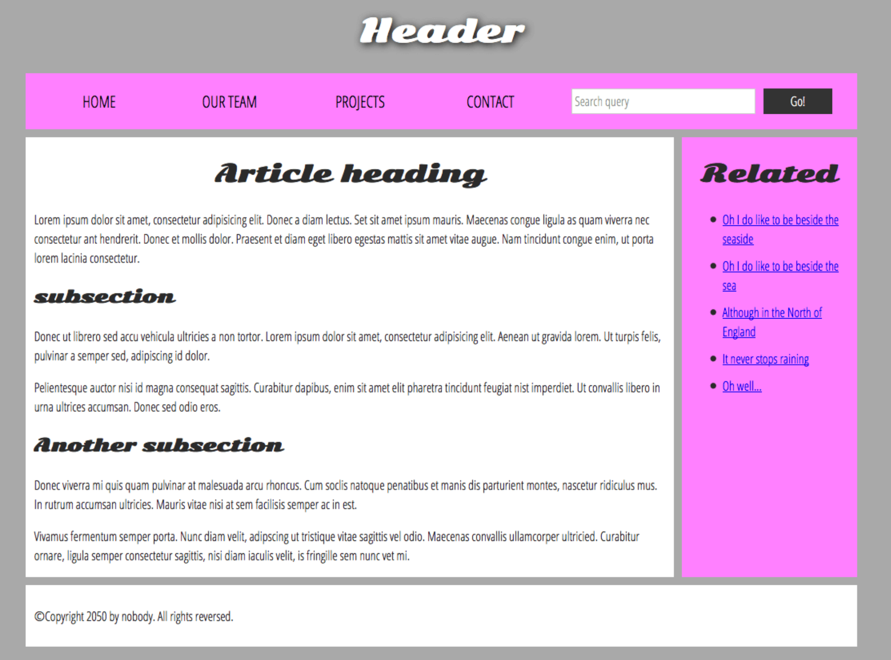

# Learn styling web pages [reading note of [Mozilla Structing components](https://developer.mozilla.org/en-US/docs/Learn_web_development/Core/Structuring_content/Structuring_documents)]



[Facts] Most webpages tend to share similar standard components. It's important to respect semantics and use the right element for the right job, because the html/css is too flexible. 

"It's good to understand the overall meaning of all the HTML sectioning elements in detail."
>See link here [HTML element reference (not too many)](https://developer.mozilla.org/en-US/docs/Web/HTML/Element)

## HTML structure has
These below are so-called 'semantic elements'. `<div>, <span>..` are non-semantic wrappers usually used with a suitable `class` attribute, to they can be easily targeted. 


### 1. header: a big heading, logo. remains consistent for a website usually.

`<header>`

### 2. navigation bar: links, buttons, tabs. remains consistent for a website.

`<nav>`

Navigation links are arranged as a list like this:

```html
<nav>
  <ul>
    <li><a href="#">Home</a></li>
    <li><a href="#">Our Team</a></li>
    <li><a href="#">Projects</a></li>
    ...
  </ul>
</nav>
```

A search bar and a button as a `<form>`.


```html
<form>
  <input type="search" name="q" placeholder="Search query" />
  <input type="submit" value="Go!" />
</form>
```

### 3. main content: video, story, map, news.
> 'main' can only used once per page. It should be `<body>  <main>`

```html
<main> 
    <article>
        <h2>
        <p>
        <section>
            <h3>
            <p> a paragraph
            <p>

        <section>
            <h3>
            <p>
```


### 4. sidebar: info, links, quotes, ads

```html
<aside>
    <h2> Related
    <ul>
        <li>
        <li>
        <li>
```

### 5. footer: fine print, copyright notices, contact info.

```html
<footer>
  <p>@copyright 2025 by me. All rights reserved.
```

## CSS layout
