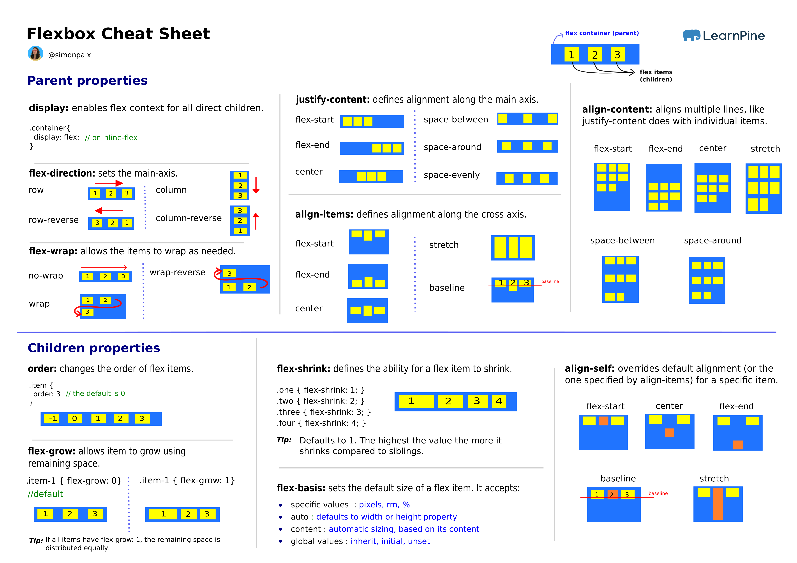
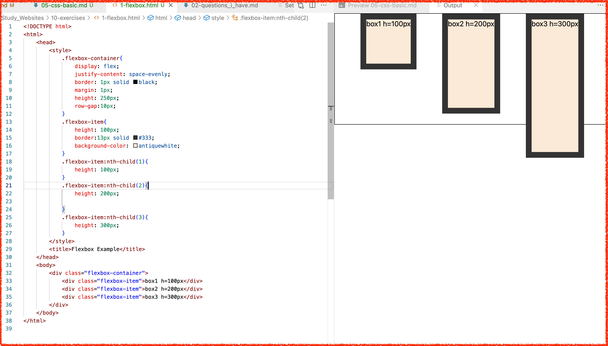
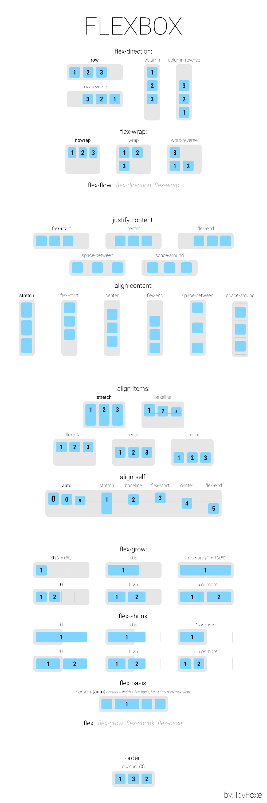

# Basic CSS knowledge

>Reference: https://blog.webdevsimplified.com/2021-11/flexbox/

Two important part: 1-selectors, 2-styling gramma

Order of selectors
id(`#id`) > class(`.class`) > element (`h1`)


Color

Box model

margin>border>padding>content
units: px, %(of the parent), em(size of parent font), rem(root em), 
```css
.box{
    height:
    width:
    padding:
    margin:
    border:
    background-color
}

```

## Flexbox
A cheat sheet:


>**'Container and items'**. Two main components: the flexbox **container** and flexbox **items**. The container is the parent element that contains all the flexbox items as its children. 

>**'Main axis and cross axis'**, by default main axis goes horizontally acroos the container and cross axis goes vertically.

### For container:
1. `display:flex`
1. `flex-direction` tells what 'main axis' and 'cross axis' direction are.
   1. row(default): means main axis is horizontal(and starts on the left)  and cross axis is  vertical(and starts at the top)
   2. row-reverse: the main axis is horizontal(but starts on the righ), corss axis unchanged
   3. column: main axis is vertical and cross axis is horizontal
   4. column reverse:
2. `justify-content` in 'main axis'
   1. flex-start(default): align to left of the axis
   2. flex-end: align to right
   3. center: all items placed in the center of the main axis
   4. space-between: evenly spreds space in between each items
   5. space-around: add half left, half right side space + effects of space-between
   6. space-evenly: add same space in left/right sides and in between items.
3. `align-items` in 'cross axis'
   1. stretch(default): in cross axis, items fill the full height.
   2. flex-start: start at the top of the cross axis
   3. flex-end: start at the bottom of the cross axis
   4. center: ceter based on the cross axis
4. `align-content`, same as 'align-items' but only works when contents are wrapping.
5. `flex wrapping`, for a container, wrap items if this container has more than it can fit on one line. Very rarely used.
   1. wrap: if an item would overflow in the main axis, put it on a new line
   2. nowrap(default): stop a flex container from wrapping your items
6.  `gap`, `row-gap`, `column-gap`

### For each item:
1. `align-self` for a specific item in the container, similar to 'align-items'
2. Sizing flex items in 'main axis'
   1. `flex-grow(default=0)`: for a item, define how much of the extra white space this item can take in its container
      1. =0(default): item doesn't get any extra space
      2. =N: get N part of the space, this item get N/(sum of all other Ns) of the white space.
   2. `flex-basis`, define a item's starting space proportion
      1. =auto(default): use the 'width' property of the item
      2. =0,
      3. =30%, of the item's parent's width
   3. `flex-shrink`, for a item, define how much to shrink if all items over flow the main axis.
      1. N=1(default): each item shrinks evenly
      2. 0=prevent this item from shrinking
      3. N=2/3/4/5... : this item shrinks N/(sum of Ns)
   4. `order`, set the specify order for a item, '1,2,3...'

>'Flex Shorthand' 
```css
flex:1 0 10px;
equals to
flex-grow:1;  flex-shrink:0; flex-basis:10px;
```


## My exercise


Another cheat sheet:
