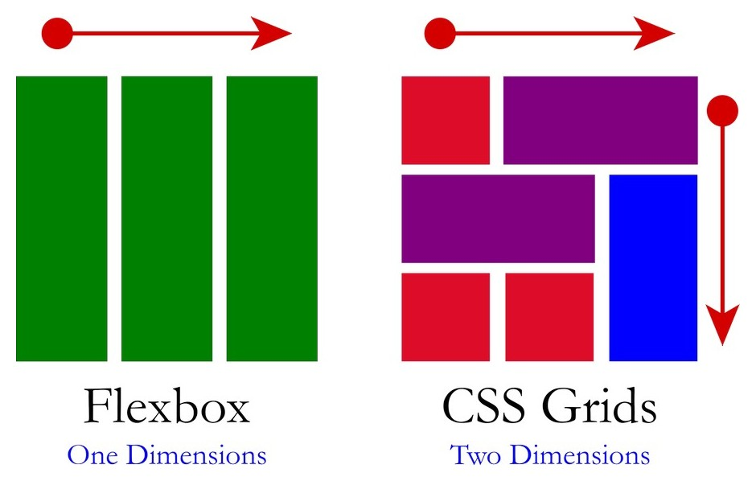
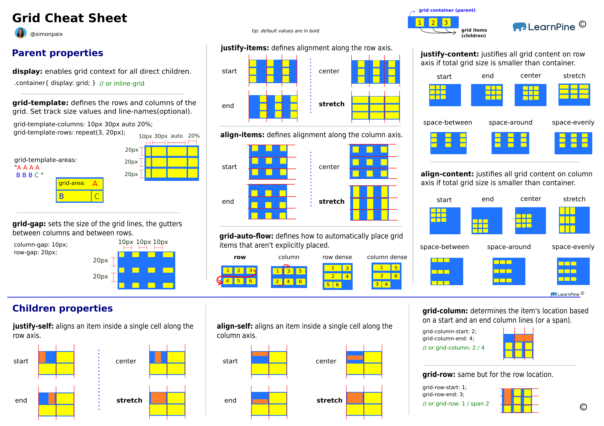

# 1. CSS Grid Usage [2025/1/30]

## 2. Cheat Sheet

## 3. My Exercises

## 4. Grid Properties

### Parent properties

1. `grid-auto-rows`: set the default row height template patterm.
   1. =100px: means default height for rows is 100px
   2. =minmax(100px, auto): means min height is 100px and grows if the content exceeds the minimum height.
