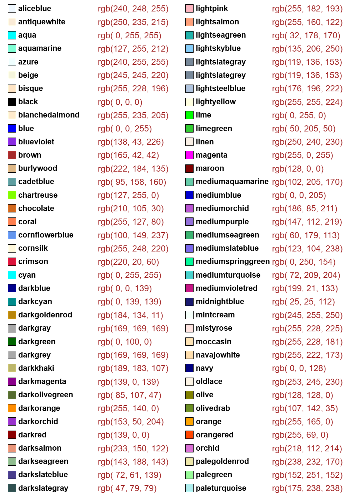
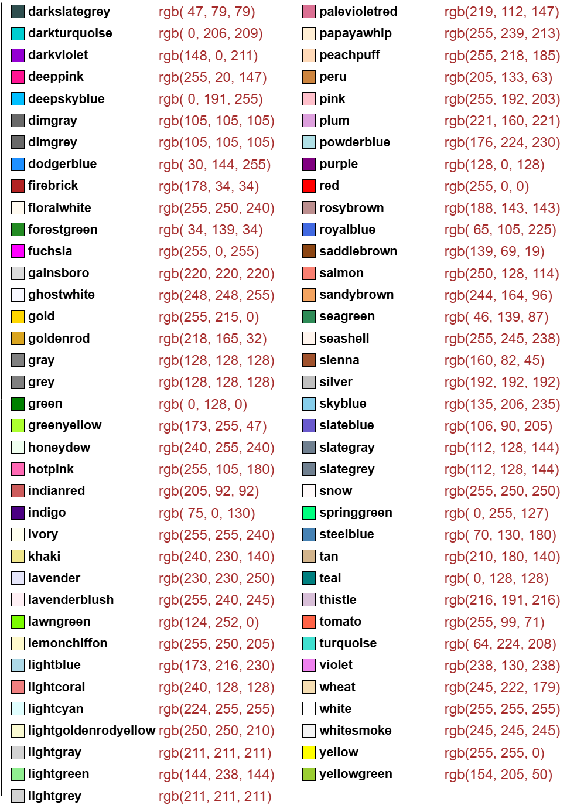

# CSS/SVG Colors

[2025-02-10 14:21:56]
Reference:

1. color table: https://www.w3.org/TR/SVG11/types.html#ColorKeywords
2. how to write colors: https://docs.aspose.com/svg/net/drawing-basics/svg-color/
3. mozilla svg tutorial: https://developer.mozilla.org/en-US/docs/Web/SVG/Tutorial/Getting_Started

## Recognized color keyword names

|                                                       |                                                      |
| ----------------------------------------------------- | ---------------------------------------------------- |
|  |  |
